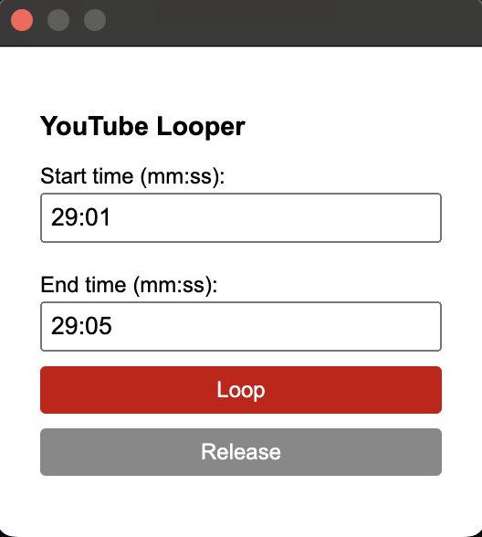

# YouTube Looper

Loop a segment of a youtube video.

#### Chrome extension written entirely by openai 4.1

(my first personal AI slop contribution)

I'm the type where I listen to a big youtube mix just to find one little song I want to repeatedly loop.

- Go to a video, input the desired start time and end time and press 'loop'.
- To end the loop, press 'release' or refresh the page.

